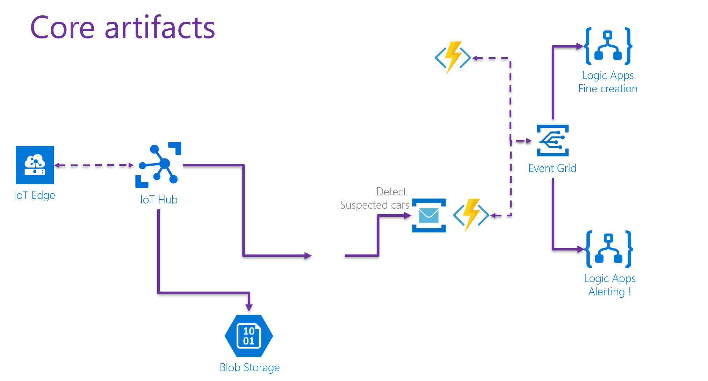

# Deployment guidelines
## Real time data analytics with Azure IoT
[](https://dev.azure.com/SamVanhoutte/real-time-traffic-iot/_build/latest?definitionId=1&branchName=master)

## Deploy core artifacts
In order to deploy the core artifacts, you can use the ARM template file, [located here](../deploy/arm/01-core-artifacts/template.json).  The only (optional) parameter that has to be passed to the deployment is ´solution_name´ (which defaults to 'traffic').  This variable will be used to make all artifacts unique.  (the value should not contain hyphen, but only alphanumeric characters, as it is also used to create a storage account)

Deploying the template through PowerShell can be done, using the following code:
```powershell
Connect-AzAccount

Select-AzSubscription -SubscriptionName <yourSubscriptionName>

New-AzResourceGroup -Name <yourResourceGroup> -Location "West Europe"
New-AzResourceGroupDeployment -Name TrafficDeployment -ResourceGroupName <yourResourceGroup> -TemplateFile .\deploy\arm\01-core-artifacts\template.json -solution_name trafficdemo
```

A successful deployment should result in the following components to be deployed.


## Deploy EventGridTrigger function
After running the above script, a function app is created in the resource group.  Now it is needed to deploy the EventGridTrigger function manually, so that it can be used and references in the Azure Stream Analytics job, in the next step.
For this, follow the following steps:
1. Open the TrafficDemo.sln solution in Visual Studio
1. Navigate to the EventGridFunctions project in the Cloud solution folder
1. Right click the project and select the Publish action in the context menu
1. In the wizard, select 'Select Existing' in the publish target window.
1. Select your subscription, your created resource group and the function app with your solution name.
1. Click OK.
1. If needed, click OK to update the version of the function app on Azure
1. If all goes well, the function is now ready to be used in the next step.

## Deploy Azure Stream Analytics artifacts

### Deploy the Stream Analytics cloud job
In order to deploy the ASA cloud job, you can use the ARM template file, [located here](../deploy/arm/02-stream-analytics/cloud-template.json).  Use the same ´solution_name´ parameter as in the first step to generate the code.

Deploying the template through PowerShell can be done, using the following code:
```powershell
Connect-AzAccount

Select-AzSubscription -SubscriptionName <yourSubscriptionName>

New-AzResourceGroupDeployment -Name TrafficDeployment -ResourceGroupName <yourResourceGroup> -TemplateFile .\deploy\arm\02-stream-analytics\cloud-template.json -solution_name trafficdemo
```

 ## Deploy Azure Databricks artifacts

To do